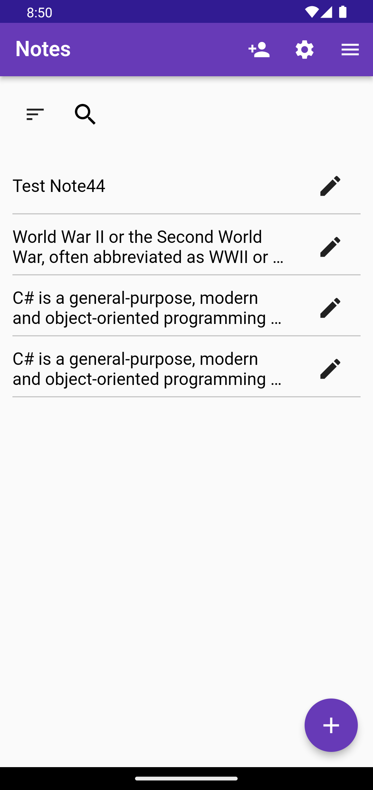
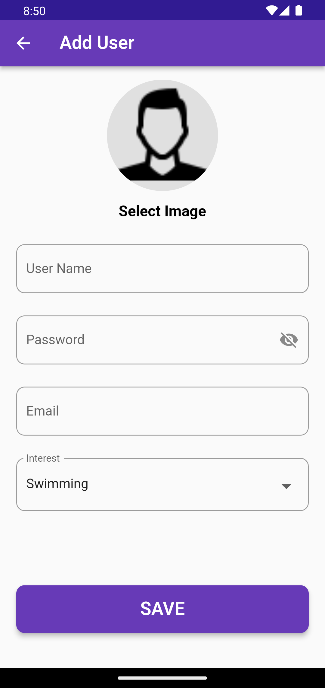
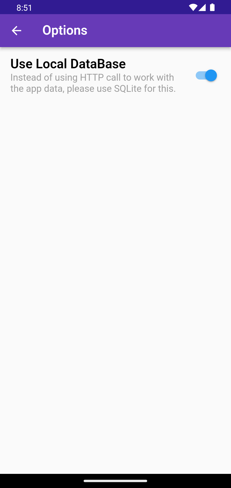
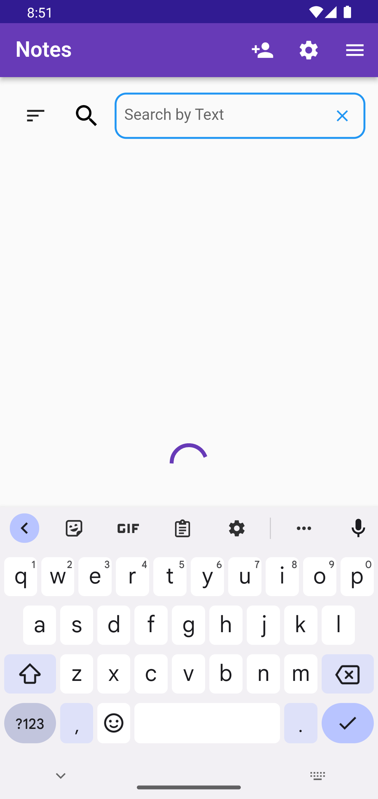

# task_pos

Used Features :

Filter by User.
Search by text.
Add user.
Add Notes and assign to specific user.
Edit Notes and assign to specific user.
Toggle Data Source.
Use SQfLite.

apk for test: https://drive.google.com/file/d/110EB32Ge-KtLVeViboZKz4WHHMmJ0XM2/view?usp=sharing

